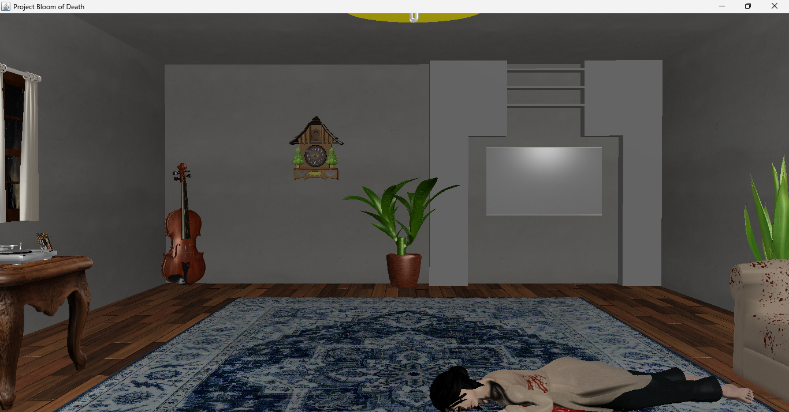
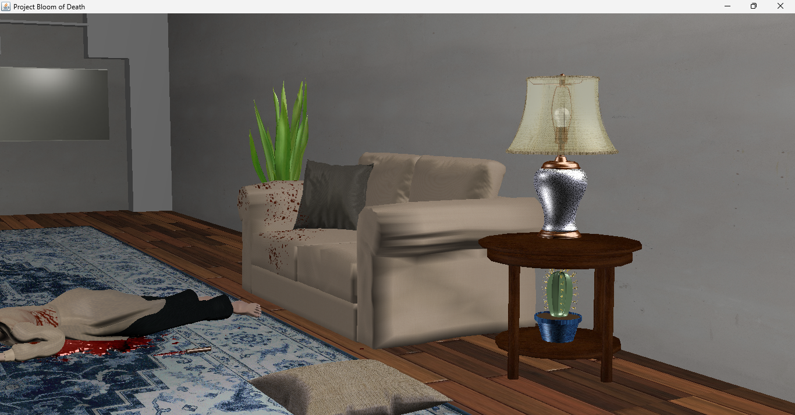
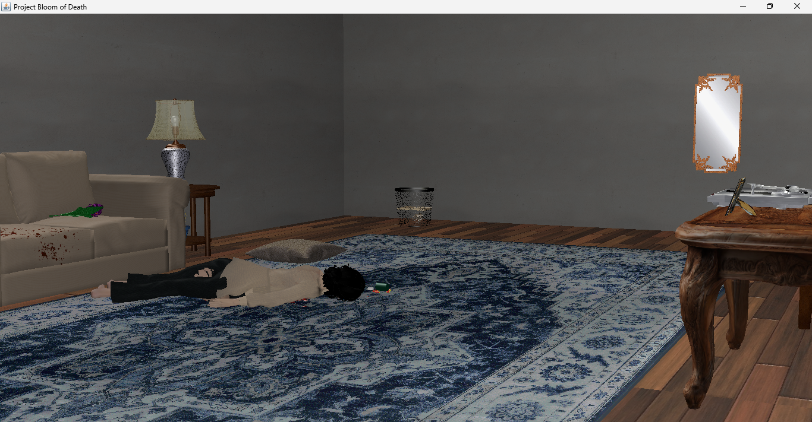
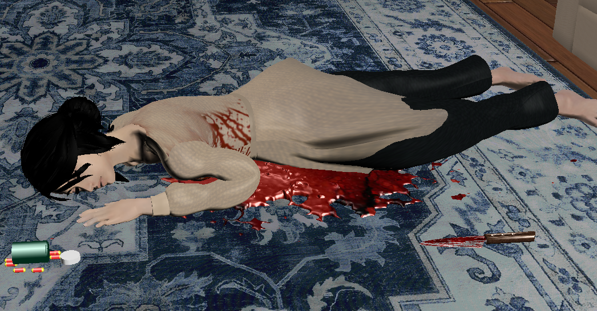
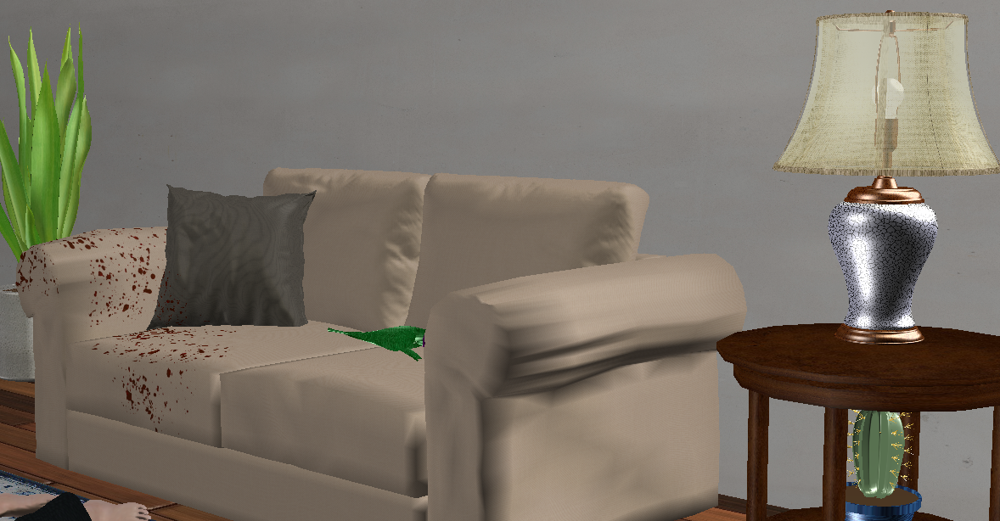
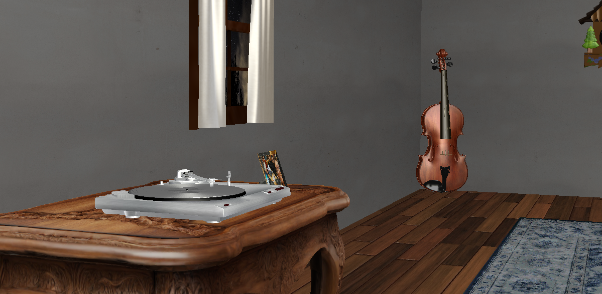

# 🌸 Project: Bloom of Death

**Bloom of Death** is a narrative-driven interactive mystery experience. The player wakes up in a mysterious room, beside a corpse, with no memory of what happened. Their goal is to explore the environment, interact with various objects, uncover hidden clues, and piece together the truth behind the murder. But beware—an unexpected twist awaits at the end.

---

## 🎮 Features

- **Interactive Crime Scene**: Explore and investigate objects in a detailed 3D room environment.
- **Immersive Java3D Graphics**: Built using Java3D to provide a realistic and atmospheric visual experience.
- **Collision Detection**: Objects have boundaries—no walking through tables or walls.
- **Mouse & Keyboard Interaction**: Use intuitive controls to move around and interact with items.
- **Environmental Animations**: Effects like opening letters, flickering lights, and turning on the TV add realism.
- **Dynamic Sound Design**: Unique sound effects for various objects and immersive ambient audio.
- **Cinematic Effects**: Includes camera shakes and other visual effects to enhance storytelling and tension.
- **First-Person Navigation**: Classic FPS-style controls for seamless exploration.

---

## 📁 Project Structure

```plaintext
Bloom of Death/
├── objects/                    # 3D model files (.obj)
├── sounds/                     # Sound effects and background audio
├── textures/                   # Textures applied to 3D models
├── lib/                        # External Java libraries (Java3D, etc.)
├── Preview/                    # Demo screenshots
├── src/
│   ├── core/                   # Core game logic and state management
│   │   ├── GameState.java
│   │   ├── TriggerEvents.java
│   │   └── BODMain.java
│   ├── models/                 # All interactive and decorative 3D objects
│   ├── audio/                  # Sound handling logic
│   │   ├── SoundManager.java
│   │   └── SoundUtilityJOA.java
│   └── effects/                # Lighting, camera, inner thoughts, and other visual effects
│       ├── CameraEffects.java
│       ├── InnerThought.java
│       ├── Lights.java
│       └── Display2DImage.java
├── README.md                   # This file
├── Project's Report            # Final project documentation/report
├── .settings/                  # IDE settings (Eclipse-specific)
├── .classpath & .project       # Eclipse project configuration
└── bin/                        # Compiled bytecode
```

---

## 🚀 How to Run the Project

1. **Clone or Download the Repository**
   - Clone via Git or download the ZIP file and extract it.

2. **Import into Eclipse**
   - Open Eclipse.
   - Navigate to **File > Import > General > Existing Projects into Workspace**.
   - Browse and select the root folder of the project.

3. **Configure the Java Runtime**
   - Ensure you're using a **JDK** (not JRE) in your build path.
   - Add the necessary VM arguments for Java modules:
     ```
     --add-exports=java.base/java.lang=ALL-UNNAMED
     --add-exports=java.desktop/sun.awt=ALL-UNNAMED
     --add-exports=java.desktop/sun.java2d=ALL-UNNAMED
     ```

4. **Run the Application**
   - Navigate to `BODMain.java` in the `core` package.
   - Right-click the file and select **Run As > Java Application**.

---


## 🎥 Preview Video

Watch a short gameplay preview of *Bloom of Death*:

👉 [Watch on Google Drive](https://drive.google.com/file/d/1pEHUG0f4qjVnMa_fV60Fxg4G14Ds4aoU/view?usp=sharing)









---

## 📝 Notes

- This project was developed as part of an academic course and is intended for educational/demonstration purposes.
- Some models and sounds were adapted from open-source or free-to-use resources.
- Java3D setup might require additional configuration depending on your OS.
